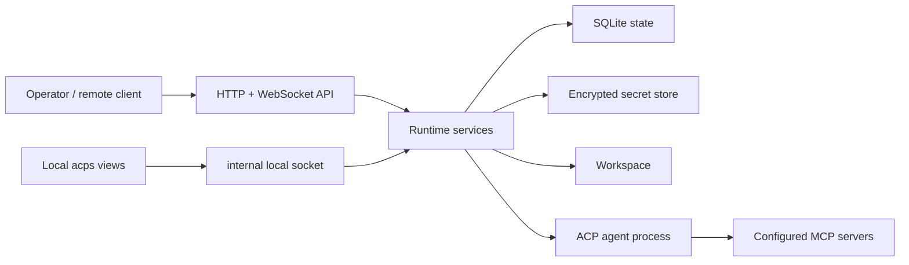

# Architecture

`acp-stack` is a Rust runtime with one CLI and daemon binary (`acps`) backed by shared runtime modules.

## Runtime Shape

## Subsystems

| Subsystem        | Responsibility                                                    |
| ---------------- | ----------------------------------------------------------------- |
| Config           | load, validate, import, export, and canonicalize TOML             |
| Auth             | API key validation, auth tiers, and request envelopes             |
| API              | HTTP routes, WebSocket subscriptions, and client-facing contracts |
| Bootstrap init   | hosted backend-to-instance init session API before normal keys exist |
| Local listener   | owner-only Unix-socket surface for keyless local `acps` routes    |
| State            | SQLite migrations and repositories for durable runtime records    |
| Secrets          | age-compatible key management and encrypted values                |
| Agent supervisor | process lifecycle for each configured ACP agent target            |
| Array            | multi-target fleet: per-target supervision with one primary target as the default and coordination point |
| ACP bridge       | ACP initialization, sessions, prompts, updates, and permissions   |
| Session changes  | bounded process-local reduction of explicit ACP diff tool content |
| ACP terminals    | client-side `terminal/*` handlers: per-terminal owning task, registry, capped output buffer, and command-log recording (`src/runtime/agent/acp_terminal.rs`, sharing spawn/kill/read primitives with the command gateway via `commands/exec.rs`) |
| Model catalog    | cached `models.dev` model metadata for prompt modality gating     |
| Agent switch     | harness migration planning and provider/API-key compatibility     |
| Native config import | redacted inspection and transactional semantic replacement of supported harness global config |
| Install catalogs | curated agent registry, Agent Skills source registry, and skills installer |
| Workspace        | bounded file operations and workspace source materialization      |
| Command gateway  | policy-mediated shell command execution and output capture        |
| Sandbox          | optional isolation backend wrapping each harness and mediated-shell spawn so the workload cannot read the daemon's secrets/state or reach its socket |
| Permissions      | durable approval, denial, cancellation, and expiry                |
| Dependencies     | declaration checks and explicit install actions                   |
| Logging          | local event history, metrics, and optional external sink          |
| Edge             | reverse-proxy/tunnel artifacts and optional Cloudflare provisioning |

## Boundaries

- `acp-stack` supervises one or more agent targets per runtime; Array mode adds targets beyond the single default, with one `primary_target` as the coordination point (see [../specs/array.md](../specs/array.md)).
- Config is portable and contains references, not secret values.
- SQLite is the local source of truth for runtime history.
- The secret store is the only source for secret values.
- External telemetry sinks consume the same normalized event stream as local SQLite logging.
- Agent behavior stays behind ACP; `acp-stack` owns runtime mediation around it.
- Native Agent-config import derives the parser and fixed user-global destination from the configured harness. It separates compatible canonical candidates from protected and unmanaged fields, then commits canonical and harness-native files as one journaled transaction.
- The sandbox backend is selected by config and is portable across deployments; the set of masked sensitive paths is derived from the runtime's own path helpers, never from operator config.
- `acps init serve` exposes only bootstrap init routes and exits after result acknowledgement; normal session/admin routes are not available in bootstrap mode.
- The local socket is allowlisted for low-risk observability plus admin-enabled session-tier HTTP access; public admin APIs are not exposed through it.
- Deployment profiles should not change runtime behavior, only process and edge shape.

## Maintainer Notes

Development and verification guidance lives in [development.md](development.md). Product behavior contracts live under [../specs](../specs).
