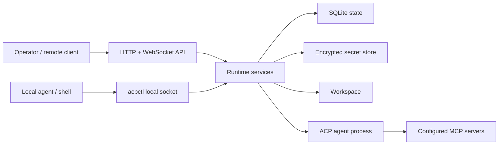

# Architecture

`acp-stack` is a Rust runtime with one daemon-facing CLI (`acps`), one local agent-facing CLI (`acpctl`), and a shared library behind both binaries.

## Runtime Shape

## Subsystems

| Subsystem        | Responsibility                                                    |
| ---------------- | ----------------------------------------------------------------- |
| Config           | load, validate, import, export, and canonicalize TOML             |
| Auth             | API key validation, auth tiers, and request envelopes             |
| API              | HTTP routes, WebSocket subscriptions, and client-facing contracts |
| Local listener   | owner-only Unix-socket surface for `acpctl`                       |
| State            | SQLite migrations and repositories for durable runtime records    |
| Secrets          | age-compatible key management and encrypted values                |
| Agent supervisor | process lifecycle for the configured ACP agent                    |
| ACP bridge       | ACP initialization, sessions, prompts, updates, and permissions   |
| Workspace        | bounded file operations and workspace source materialization      |
| Command gateway  | policy-mediated shell command execution and output capture        |
| Permissions      | durable approval, denial, cancellation, and expiry                |
| Dependencies     | declaration checks and explicit install actions                   |
| Logging          | local event history, metrics, and optional external sink          |
| Edge             | generated reverse-proxy/tunnel config artifacts                   |

## Boundaries

- `acp-stack` supervises one configured ACP agent per runtime.
- Config is portable and contains references, not secret values.
- SQLite is the local source of truth for runtime history.
- The secret store is the only source for secret values.
- External telemetry sinks consume the same normalized event stream as local SQLite logging.
- Agent behavior stays behind ACP; `acp-stack` owns runtime mediation around it.
- `acpctl` is local and allowlisted; public admin APIs are not exposed through it.
- Deployment profiles should not change runtime behavior, only process and edge
  shape.

## Maintainer Notes

Development and verification guidance lives in [development.md](development.md). Product behavior contracts live under [../specs](../specs).
