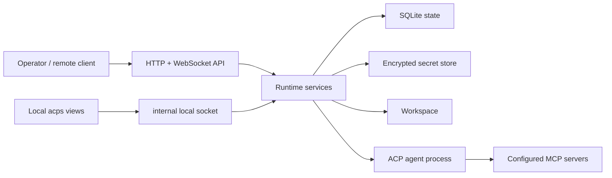

# Architecture

`acp-stack` is a Rust runtime with one CLI and daemon binary (`acps`) backed by shared runtime modules.

## Runtime Shape

```mermaid
flowchart LR
    Operator["Operator / remote client"] --> API["HTTP + WebSocket API"]
    Local["Local acps views"] --> LocalSocket["internal local socket"]
    API --> Runtime["Runtime services"]
    LocalSocket --> Runtime
    Runtime --> State["SQLite state"]
    Runtime --> Secrets["Encrypted secret store"]
    Runtime --> Workspace["Workspace"]
    Runtime --> Agent["ACP agent process"]
    Agent --> MCP["Configured MCP servers"]
```

## Subsystems

### API surfaces

- API — HTTP routes, WebSocket subscriptions, and client-facing contracts.
- Auth — API key validation, auth tiers, and request envelopes.
- Local listener — owner-only Unix-socket surface for keyless local `acps` routes.
- Bootstrap init — hosted init session API before normal keys exist. A typed server-frame surface (`src/cli/init/serve/frames.rs`) forwards raw init-flow signals as `signal` events; the client folds them, and the instance keeps a bounded signal log for hello/status replay.

### Config, state, and secrets

- Config — load, validate, import, export, and canonicalize TOML.
- State — SQLite migrations and repositories for durable runtime records.
- Secrets — age-compatible key management and encrypted values.

### Agent runtime

- Agent supervisor — process lifecycle for each configured ACP agent target.
- Array — multi-target fleet: per-target supervision with one primary target as the default and coordination point.
- ACP bridge — ACP initialization, sessions, prompts, updates, and permissions.
- ACP terminals — client-side `terminal/*` handlers with per-terminal owning tasks, capped output buffers, and command-log recording (`src/runtime/agent/acp_terminal.rs`).
- Session changes — bounded process-local reduction of explicit ACP diff tool content.
- Config options — generic ACP session config-option projection and per-session snapshot (`src/runtime/agent/config_options.rs`).
- Permissions — durable approval, denial, cancellation, and expiry.

### Providers and models

- Provider CLI — target activation and status, credential catalog mutation, legacy credential migration, and shared provider validation.
- Model catalog — cached `models.dev` model metadata for prompt modality gating.
- Provider model catalog — live provider model-list fetch and per-provider cache (`src/runtime/agent/provider_model_catalog.rs`) backing `GET /v1/models` and `availableModels` provisioning.
- Agent switch — harness migration planning, provider/API-key compatibility, and the pending-switch journal (`src/runtime/agent/switch_journal.rs`) that makes retries converge.
- Native config import — redacted inspection and transactional semantic replacement of supported harness global config.

### Install and update

- Install catalogs — curated agent registry, Agent Skills source registry, and the skills installer (init plus day-2 `acps skills` / `/v1/agent/skills`).
- Agent updates — managed-agent update orchestration and installed-vs-upstream version checks (`src/runtime/install/agent_updater.rs`, `agent_version_check.rs`).
- Dependencies — declaration checks, explicit install actions, tracked apply runs, and detached init workers.
- Net rate limit — process-wide per-domain pacing and rate-limit circuit for outbound HTTP to quota-bearing hosts (`src/runtime/net_rate_limit.rs`).

### Workspace and isolation

- Workspace — bounded file operations and workspace source materialization.
- Command gateway — policy-mediated shell command execution and output capture.
- Sandbox — optional isolation backend wrapping each harness and mediated-shell spawn, masking the daemon's secrets, state, and socket.
- Extensions — typed, data-declared integration seams (`src/extensions.rs`): the network-provider policy the sandbox consumes and the managed-state apply orchestration.

### Observability and edge

- Logging — local event history, metrics, and optional external sink.
- Edge — reverse-proxy/tunnel artifacts and optional Cloudflare provisioning.

### Dev-only

- Schema export — `dev-tools`-only (`src/schema_export.rs`): derives the published `/v1` JSON Schema from the wire DTOs with a coverage check; regenerated via the `generate-api-schema` bin.

## Boundaries

### Data

- Config is portable and contains references, never secret values.
- SQLite is the local source of truth for runtime history.
- The secret store is the only source for secret values.
- External telemetry sinks consume the same normalized event stream as local SQLite logging.

### Agent

- `acp-stack` supervises one or more agent targets per runtime; Array mode adds targets beyond the single default, with one `primary_target` as the coordination point (see [../specs/array.md](../specs/array.md)).
- Agent behavior stays behind ACP; `acp-stack` owns runtime mediation around it.
- Native Agent-config import derives the parser and fixed user-global destination from the configured harness, separates compatible canonical candidates from protected and unmanaged fields, and commits canonical and harness-native files as one journaled transaction.

### Isolation and extensions

- The sandbox backend is selected by config and is portable across deployments; the masked sensitive paths are derived from the runtime's own path helpers, never from operator config.
- Platform-specific behavior ships behind the typed extension seams (`[extensions]`), each a generic contract `acp-stack` supervises or serves without learning the extension's semantics. Routes stay static, and plugin code runs only in external processes (see [../specs/extensions.md](../specs/extensions.md)).
- Network isolation is the `network-provider` extension type on the `unshare` backend: a per-spawn supervisor owns the namespace lifecycle and gates workload execution on the provider's setup. All network policy lives in the provider behind a small versioned env-var contract.
- Managed state is the `managed-state` extension type: an external orchestrator owns a named namespace through one fixed admin apply endpoint with revision watermarks, and the secret store enforces operator-vs-external provenance.

### Surfaces and deployment

- `acps init serve` exposes only bootstrap init routes and exits after result acknowledgement.
- The local socket is allowlisted for low-risk observability plus admin-enabled session-tier HTTP access; public admin APIs stay off it.
- Deployment profiles change only process and edge shape, never runtime behavior.

## Maintainer Notes

Development and verification guidance lives in [development.md](development.md). Product behavior contracts live under [../specs](../specs).

After changing any `/v1` request/response DTO or the config schema, regenerate the published schema with `cargo run --features dev-tools --bin generate-api-schema` and commit the updated `docs/specs/api/acps-schema.json` + `.meta.json`. The `--all-features` test run byte-compares the checked-in files and verifies coverage of the handler surface, so an un-regenerated change fails CI and blocks tagging. A new endpoint whose payload types are not registered in the `src/schema_export/{requests,responses}.rs` umbrellas fails the coverage test.
