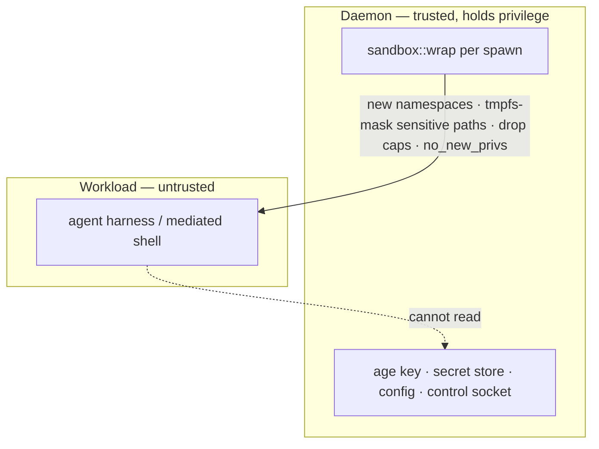

# Security

`acp-stack` treats local instance integrity as part of the product contract. The runtime fails fast on unsafe config and keeps secret values out of config, responses, and logs.

## API Keys

Two API keys are generated on first init:

| Key     | Scope                                                                   |
| ------- | ----------------------------------------------------------------------- |
| Session | public session-tier API calls, including session lifecycle and prompts  |
| Admin   | secrets, config import, agent process control, and sensitive operations |

The session key can be regenerated. The admin key is generated once and is replaced only by resetting and reinitializing the instance.

Plaintext auth keys are printed only at init or session-key regeneration time. Local state stores one-way verifier rows for the session and admin keys. Auth keys stay out of config and `secrets.age`.

`acps init serve` uses a separate bootstrap bearer token supplied by environment variable or file. The token stays out of persisted state and is valid only for the bootstrap init routes.

Hosted init status, event replay, and the category state surface keep plaintext auth keys and secret values out. That surface covers `signal` events and the replay embedded in `hello` and status. A settled category reports ids and secret ref names only. Keys appear only in the explicit WebSocket result handoff and are cleared from memory after `ack_result`.

## Key Tiering

Tiering is strict: admin and session keys grant disjoint route sets. The admin key is rejected on session-tier routes with `401 auth.wrong_kind`. The session key is rejected on admin-tier routes with the same code.

Session-tier routes cover the public API operations outside management and destructive actions: config export, workspace operations, command runs, session and prompt lifecycle, and permission approve/deny. Session operations stay session-tier even when they write rows.

`[local].session_auth = "keyless"` is a local Unix-socket exception; public API tiers stay unchanged. When enabled, same-user local callers reach session-tier HTTP routes through `acps` on socket ownership alone. Public HTTP routes still require the session key and still reject the admin key.

Both keys are presented as `Authorization: Bearer <key>` and validated against stored verifiers in constant time.

## Secret Store

Secret values are stored in the encrypted local secret store. Config files carry secret reference names only.

The same `secrets.age` ciphertext contains the instance-wide provider credential catalog. It covers mapped providers, keyed by their canonical env vars, and configured custom providers, keyed by the provider's configured `api_key_ref`. Config validation requires the `api_key_ref` to be identical across every declaration of that custom provider id, since one credential set is stored per id.

A provider has either one aliasless credential or a permanently promoted alias map. Each credential bundle contains its required and supplied env fields and retained source-ref names. An opaque revision on each bundle serves only to detect whether a running process is stale.

Catalog entries carry a provenance source: operator (the default, written by CLI and import flows) or external, owned by a named managed-state extension namespace (see [extensions.md](extensions.md)).

Overwrite protection is a property of the store. Operator flows refuse to touch external entries. An external namespace can only create entries or replace its own. The ciphertext also carries each namespace's applied-revision watermark, persisted atomically with the catalog swap. This keeps the watermark aligned with the stored credential.

### Rules

- Secret values stay out of API responses.
- Credential values and revisions stay out of provider status and credential-list output.
- Config export returns refs only.
- Agent and MCP secrets are injected only where explicitly referenced.
- Secret-ref fields reject likely pasted secret values.
- Auth keys live outside the secret store.

## HTTP Hardening

The public API enforces:

- bearer authentication
- auth tier checks
- CORS and WebSocket Origin allowlists
- request body limits
- per-key and per-IP rate limits
- temporary blocking after repeated auth failures
- bounded trusted-proxy handling
- security event logging

`trust_proxy_headers = true` accepts forwarded client metadata only from exact IPs listed in `trusted_proxies`. Keep broad public ranges out of `trusted_proxies`.

## Auth Failures And Rate Limits

Every rejected authentication is recorded in the `auth_failures` table with a structural `reason` (`missing`, `malformed_header`, `invalid`, `wrong_kind`). The attempted token value stays out of the record. After `auth_failures_per_minute` rejections in a 60-second window, the client IP is blocked for `auth_block_duration`.

Hardening errors use stable codes in the standard error envelope:

| Status | Code                      | Trigger                                          |
| ------ | ------------------------- | ------------------------------------------------ |
| `401`  | `auth.wrong_kind`         | key valid but used on the wrong tier             |
| `429`  | `auth.rate_limited`       | per-IP, per-key, or unauthenticated bucket empty |
| `403`  | `auth.origin_not_allowed` | CORS / WebSocket Origin not in allowlist         |
| `413`  | `request.too_large`       | request body exceeds the configured cap          |

## Permissions

Permission policy applies to ACP permission requests and mediated shell commands.

| Policy input      | Behavior                                   |
| ----------------- | ------------------------------------------ |
| `deny` match      | reject immediately                         |
| `review` match    | create a permission request or audit event |
| `auto` mode       | allow unmatched requests                   |
| `supervised` mode | require approval for unmatched risky work  |
| `locked` mode     | require approval for unmatched commands    |

Shell command policy matches both raw and shell-word-normalized command forms. Constructed command words require review when no deny or review pattern matches.

Pending requests expire according to config. Approval and denial decisions are durable events.

### ACP client terminals

`terminal/create` executes directly: the VM is the security boundary in place of a permission-service gate. Agents send `session/request_permission` separately when their own policy requires review.

#### Compensating Controls

- Every terminal is recorded as an `acp`-origin row in the durable command log with its output and exit status.
- Terminal children inherit the same `[workspace.sandbox]` profile as the agent harness.
- Their working directory is confined to the session workspace.
- They receive a clean session environment: managed `PATH` and `HOME` plus the agent-supplied vars.
- The `[agent].env` provider secrets go only to the agent process itself.

## Workspace Boundary

Workspace paths are resolved under `[workspace].root`. The runtime rejects absolute paths from API callers, `..` traversal, embedded NUL bytes, symlink escapes, writes through existing symlink targets, and files above `workspace.max_file_bytes`. Oversized reads/writes/uploads/downloads return `413 workspace.too_large`.

ACP `fs/read_text_file` and `fs/write_text_file` requests carry absolute paths by protocol. The runtime accepts them only when they resolve inside the session workspace through the same canonicalization and symlink refusal. Each write records a durable `fs.write` audit event.

## Local Interface

Keyless local `acps` views use a local Unix socket protected by filesystem permissions. Low-risk observability routes are always open on the socket, gated by filesystem permissions rather than public session or admin API keys.

When `[local].session_auth = "keyless"` is enabled by an admin, same-user local callers can also reach session-tier HTTP routes on socket ownership alone. Admin-tier operations stay off the local socket. Reading secret values, rotating keys, importing config, applying dependencies, and controlling public WebSocket disconnections all require the public admin API.

## Native Config Import

Native Agent-config inspection and mutation are admin-tier operations. Inspection manifests contain paths and classifications only; field values, commands, headers, credentials, and login state stay out. Uploaded content is capped at 1 MiB; the raw document exists only in the process-local, revision-bound inspection draft.

A selected import durably stages only the prepared canonical config and stripped native residual. Hosted init keeps the raw document out of persisted init arguments, events, progress, and handoff metadata.

Credentials, authentication state, permission and sandbox controls, and other `acps`-owned security fields are removed before an unmanaged residual can be written. Unmanaged hooks, notification commands, command helpers, plugins, or formatters require explicit acknowledgement for the inspected SHA-256 revision.

Transaction targets are fixed under the runtime user's home, must pass ownership and regular-file checks, and reject symlinks and linked files; managed directories and files use owner-only permissions.

## Deployment Posture

Production deployments should:

- run as an unprivileged runtime user
- configure `[workspace].runtime_user` to a local user that resolves on the host
- keep config and state directories owner-only
- bind the daemon to loopback unless a trusted platform requires otherwise
- terminate TLS at a reverse proxy or Cloudflare Tunnel
- keep runtime auth and origin checks enabled behind the edge

Dependency apply is the one path that escalates privilege: only for `scope = "system"` install actions, only through passwordless `sudo -n` (never a password prompt or a tty), and only for operator-declared snippets the operator confirmed.

## Sandbox

By default the agent harness and mediated shells run in the same process tree and OS user as the daemon, which holds the runtime's secrets, config, and control socket. For an untrusted workload this means in-runtime policy is bypassable and the on-disk secrets are directly readable.

`[workspace.sandbox]` wraps every harness and mediated-shell spawn in an isolation backend so the workload cannot read the daemon's sensitive paths or reach its socket. The default is `off`, which preserves single-process behavior unchanged.

The masked set is always derived from the runtime's own path helpers — the config directory (`~/.config/acp-stack`, holding config and the age key) and the state directory (`~/.local/share/acp-stack`, holding the secret store, state database, and local socket) — so an operator cannot misconfigure the protection away. `[workspace.sandbox].mask_paths` only adds to that set.

Backends are selected by `[workspace.sandbox].mode`:

- `off` — no wrapping.
- `unshare` — runs the workload in fresh mount, pid, ipc, and uts namespaces with a private `/proc`, the sensitive paths masked with `tmpfs`, then all capabilities and `no_new_privs` dropped before exec. Requires the daemon to hold `CAP_SYS_ADMIN`, as in a privileged container.
- `bwrap` — the same masking through `bubblewrap`, for hosts with unprivileged user namespaces.
- `custom` — an operator-supplied wrapper argv in `[workspace.sandbox].wrapper`, for any other mechanism such as `systemd-run` or `firejail`.

Secrets referenced in `[agent].env` are still delivered to the harness through its environment under every backend; only on-disk secrets and the control socket are masked. The same wrapping applies to mediated shell commands, so a shell command the agent runs cannot read the daemon's secrets either.

### Network isolation (`unshare` only)

Per-spawn network-namespace isolation is declared through a `network-provider` extension instance. Declaration rules and fields — the one-instance limit, the unshare requirement, TOML-only configuration — are specified in [extensions.md](extensions.md) under Type `network-provider`. The constraints that shape the security model:

- No declared instance means host networking: the workload shares the host network stack and the wrapper is unchanged byte for byte.
- A declared instance with a backend other than `unshare` is rejected at config load. In particular `bwrap` network isolation is not implemented, and configuring it would imply an unenforced guarantee.
- Isolated networking requires working Linux `pidfd_open` and `pidfd_send_signal` syscalls. Startup fails closed when the kernel or seccomp policy blocks them.
- `acps workspace sandbox set` refuses, without writing, a mode change that would conflict with a declared network-provider extension.

```toml
[workspace.sandbox]
mode = "unshare"

[extensions.egress]
type = "network-provider"
provider = ["/usr/local/libexec/acps-network-provider", "--config", "/etc/provider.toml"]
provider_timeout = "30s"
provider_stderr = "daemon"
```

Declaring the instance gives every wrapped spawn (agent harness and each mediated command alike) its own fresh network namespace. With an empty `provider` the namespace is deny-all: acp-stack configures nothing, not even loopback. All network policy — veth devices, routes, DNS, gateways, proxies — belongs to the operator-supplied provider. acp-stack never injects proxy variables, configures interfaces, resolves DNS, or inspects traffic.

#### Provider Contract

- The provider is invoked as `<executable> setup <configured-args...>` once the namespace exists, before the workload runs. It is invoked as `<executable> teardown <configured-args...>` after the workload exits. Each phase is bounded independently by `provider_timeout` (default `30s`).
- The executable must be an absolute path. Mediated spawns can run without `PATH` in their environment, so name resolution is not deterministic.
- Setup is fail-closed. On nonzero exit or timeout the workload never runs, teardown is attempted for partial-setup cleanup, and the spawn fails.
- Both phases must be idempotent.
- Each phase runs in an internal monitor's process group. A liveness fd makes supervisor death kill the monitor, provider, and descendants. Providers must stay in that inherited group: no daemonizing, no `setsid`, no detaching.
- The provider runs with the supervisor's privileges, `/` as its working directory (never the agent-writable workload cwd), and a cleared environment holding exactly the contract variables. It must set its own `PATH`. Agent environment variables and secrets never reach it.

The cleared environment carries exactly these variables:

- `ACPS_SANDBOX_NETWORK_PROTOCOL=1` — provider protocol version.
- `ACPS_SANDBOX_NETWORK_ID=<random-id>` — unique identifier for this wrapped spawn.
- `ACPS_SANDBOX_NETWORK_NAMESPACE=<proc-fd-path>` — namespace handle usable with `setns` or `nsenter`, valid through teardown.
- `ACPS_SANDBOX_NETWORK_PID=<host-pid>` — namespace-owning process PID, guaranteed during setup only; omitted at teardown.

Provider stdout is always discarded so it cannot corrupt the ACP transport. Provider stderr goes to the daemon's diagnostic channel (`provider_stderr = "daemon"`, the default) or is discarded (`"null"`). It is never attached to a mediated command's captured output. A provider killed by supervisor SIGKILL must reconcile any host resources not tied to namespace destruction on its next run.

A network namespace isolates the IPv4/IPv6 stacks and abstract-namespace Unix sockets. It does not block pathname Unix sockets — those are filesystem objects. The daemon's control socket stays protected by the tmpfs path masking above, not by the network namespace.


```mermaid
flowchart TB
    subgraph Daemon["Daemon — trusted, holds privilege"]
        Sensitive["age key · secret store · config · control socket"]
        Wrap["sandbox::wrap per spawn"]
    end
    subgraph Workload["Workload — untrusted"]
        Harness["agent harness / mediated shell"]
    end
    Wrap -->|"new namespaces · tmpfs-mask sensitive paths · drop caps · no_new_privs"| Harness
    Harness -. cannot read .-> Sensitive
```

## Security Self-Check

The admin-tier public `GET /v1/security/check` route and keyless local `acps security check` diagnostic report findings for common misconfiguration: unsafe binds, wildcard browser origins, excessive auth failures, loose file modes, ownership mismatches, unwritable workspaces, unavailable required dependencies, and external logging delivery failures.

Findings include severity (`warning` or `critical`), code, message, an optional structured `details` payload for findings with machine-readable context, and remediation when an operator action is available.

### History

Every self-check invocation through `GET /v1/security/check` is persisted into the `security_runs` and `security_findings` tables in the local state database. The check response includes the generated `run_id` so operators can correlate the live response with the durable row. Runs are kept indefinitely.

- `GET /v1/security/history?limit=N&after=<run-id>` (admin tier) returns recent runs newest-first with aggregate counts and a `next_cursor` for keyset pagination while a full page is returned — it is `null` once a short page comes back (an exactly-full final page still yields a cursor whose follow-up returns no rows). `limit` defaults to 20 and is capped at 500 (values above it are clamped, not rejected).
- `GET /v1/security/history/{run_id}` (admin tier) returns a single run with its findings in emit order, replaying exactly what `acps security check` produced.
- `acps security history [--limit N] [--after <id>] [--json]` prints the operator table or raw JSON.
- `acps security show <run-id> [--json]` prints the run summary plus its findings.

Aggregate run status is `succeeded` when no critical findings were emitted and `failed` otherwise; the orthogonal `ok` boolean is true only when neither warnings nor critical findings were emitted.

### Finding categories and remediation coverage

Every newly emitted finding carries a non-empty remediation; findings replayed from history written before this guarantee may lack one. The category-to-code map for the operator-facing self-check is:

- key: `auth.failure_threshold`
- file permission: `runtime.path_ownership`, `runtime.path_mode_loose`, `runtime.path_uninspectable`, `runtime.workspace_not_writable`
- origin and CORS: `http.wildcard_origin_public_bind`, `edge.cloudflare.unsafe_origins`
- proxy: `http.trust_proxy_without_trusted_proxies`, `edge.cloudflare.missing_local_trusted_proxies`
- sink: `logging.supabase.delivery_failing`
- deps: `deps.required_unavailable`
- runtime user: `runtime.user_mismatch`
- bind: `api.public_bind`, `edge.cloudflare.public_bind_tunnel`, `edge.cloudflare.cloudflared_missing`, `edge.cloudflare.headers_missing`, `edge.cloudflare.direct_public_requests`

`deps.required_unavailable` is emitted when required dependency declarations are unavailable. Details include a bounded list of dependency names, kinds, features, and reasons; the complete report remains available from `acps deps check`.
